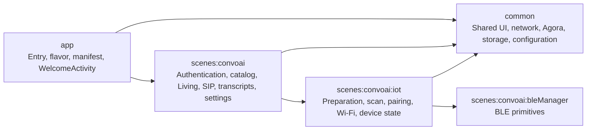
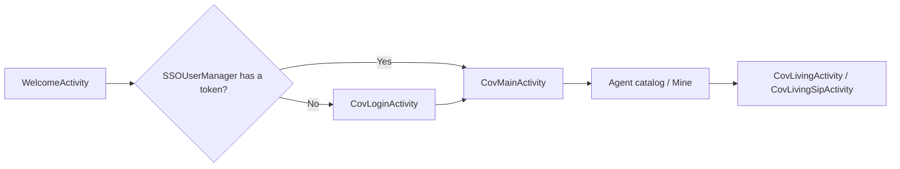
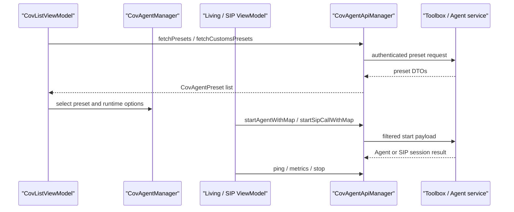
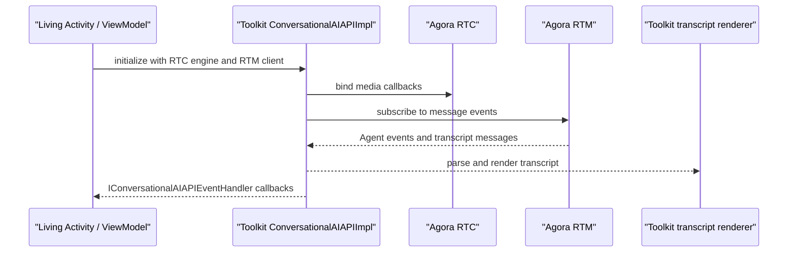
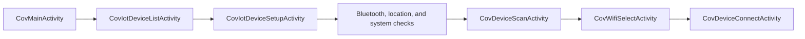
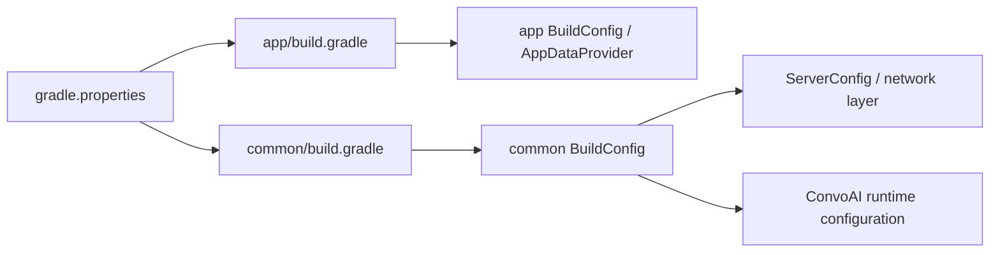

# Android Architecture

This document gives developers and AI agents a durable model of the Android repository: module ownership, runtime flows, configuration and contract boundaries, external integrations, and high-risk areas. Use the relevant README for setup or component integration and `AGENTS.md` for collaboration and acceptance rules.

## 1. System Context

Shengwang Convo AI Demo for Android demonstrates:

- conversational AI sessions;
- Agora RTC and RTM media and messaging;
- transcript rendering and session events;
- Agent preset, LLM, TTS, and Avatar configuration;
- SIP calling;
- IoT and BLE provisioning and connectivity.

This is a demo application. Do not assume that demo defaults, local credentials, mocks, or fallback behavior are production contracts.

## 2. Module Topology

| Module | Ownership | Notes |
|---|---|---|
| `app` | Application entry, startup routing, flavor, manifest, signing, APK naming, app-level `BuildConfig` | Entry activity: `WelcomeActivity` |
| `common` | Shared UI base classes, debug support, network, Agora dependencies, storage, utilities, configuration | Broadest consumer impact |
| `scenes:convoai` | Authentication, Agent catalog, Living and SIP sessions, transcripts, avatar, settings | Main product module |
| `scenes:convoai:iot` | Device preparation, permissions, Bluetooth/Wi-Fi provisioning, device list and connection | Depends on `bleManager` |
| `scenes:convoai:bleManager` | BLE primitives | Consumed by the IoT module |

Key packages:

- `common/src/main/java/io/agora/scene/common/ui`
- `common/src/main/java/io/agora/scene/common/net`
- `scenes/convoai/src/main/java/io/agora/scene/convoai/ui`
- `scenes/convoai/src/main/java/io/agora/scene/convoai/api`
- `scenes/convoai/src/main/java/io/agora/scene/convoai/rtc`
- `scenes/convoai/src/main/java/io/agora/scene/convoai/rtm`
- `scenes/convoai/src/main/java/io/agora/scene/convoai/ui/living/legacy`
- `scenes/convoai/iot/src/main/java/io/agora/scene/convoai/iot`

The current conversational client API and transcript implementation are consumed from the published Maven component `io.agora.agents:agora-agent-client-toolkit`. The component requires API 26, which is also the Android application's minimum SDK. Only the legacy v1 RTC stream renderer remains in the Demo source tree.

## 3. Runtime Flows

### 3.1 Startup and Authentication

- `app` decides whether startup enters authentication or the main activity.
- `SSOUserManager` and the authentication ViewModel own user and token state.
- `CovMainActivity` hosts the Agent catalog and Mine surfaces.

### 3.2 Agent Catalog, Configuration, and Lifecycle

- `CovApiModes.kt` contains server-facing preset and related DTOs.
- `CovAgentManager` holds the selected preset and mutable runtime options.
- `CovAgentApiManager` owns request shaping, authentication, preset fetch, Agent/SIP start, ping, metrics, and stop calls.
- Payload field names, omission rules, defaults, preset classifications, and endpoint behavior form a backend contract. Update mappings, callers, mocks, and focused contract tests together.

### 3.3 Realtime Session and Transcript Path

- `CovLivingViewModel` and `CovLivingSipViewModel` create `ConversationalAIAPIImpl`.
- Messages, interruption, metrics, images, and transcript updates return through `IConversationalAIAPIEventHandler`.
- `io.agora.agents:agora-agent-client-toolkit` owns the public API, RTM event handling, and current transcript renderer.
- `ui/living/legacy` owns the Demo-only v1 RTC stream renderer because that compatibility path is not part of the published toolkit.

### 3.4 IoT and BLE

This path depends on runtime permissions, Bluetooth, location services, Wi-Fi, and physical devices. Emulator-only evidence is insufficient for end-to-end acceptance.

## 4. Configuration and Contract Boundaries

### 4.1 Build-Time Configuration

The main local configuration source is `gradle.properties`. Current consumers include:

- `app/build.gradle` for app identity, flavor output, RTC identity, and `TOOLBOX_SERVER_HOST`;
- `common/build.gradle` for shared server, authentication, open-source mode, LLM, TTS, and Avatar values.

Never commit real values for App IDs, certificates, bearer tokens, API keys, basic-auth secrets, or vendor credentials.

### 4.2 Runtime Contracts

| Boundary | Primary owners | Change risk |
|---|---|---|
| Agent REST payload and response DTOs | `api/CovAgentApiManager.kt`, `api/CovApiModes.kt` | Backend compatibility, defaults, omitted fields, preset behavior |
| Selected preset and session settings | `constant/CovAgentConfig.kt` | Cross-screen state, RTC identity, feature enablement |
| Server and temporary RTC configuration | `common/.../ServerConfig` | Endpoint and session identity behavior |
| RTC/RTM event contract | Published Agent Client Toolkit, Living ViewModels | Media, messaging, interruption, metrics |
| Current transcript rendering | Published Agent Client Toolkit | Parsing, ordering, compatibility, UI callbacks |
| Legacy v1 transcript rendering | `ui/living/legacy` | RTC stream parsing and legacy UI callbacks |

When an external contract is unavailable, use an explicitly approved mock and keep the missing server evidence visible. Do not infer production behavior from a local fixture.

## 5. External Integrations and System Capabilities

External integrations:

- Agora RTC and RTM;
- Toolbox and Agent services;
- LLM, TTS, and Avatar providers;
- SIP services;
- IoT devices and BLE peripherals.

Important Android capabilities include `INTERNET`, `CAMERA`, `RECORD_AUDIO`, `FOREGROUND_SERVICE`, `POST_NOTIFICATIONS`, and `READ_MEDIA_IMAGES`. IoT additionally uses Bluetooth and location permissions. Validate request timing, denial, retry, recovery, and Android-version differences when relevant.

## 6. High-Risk Areas

1. Agent REST and preset contracts: small payload or default changes can alter server behavior across standard, custom, SIP, and debug flows.
2. `common`: shared network, UI, Agora, storage, and configuration changes have broad consumer impact.
3. Published Agent Client Toolkit and `ui/living/legacy`: RTC, RTM, parsing, transcript rendering, and UI callbacks meet here.
4. IoT and BLE: behavior depends on permissions, radios, system services, firmware, and physical-device state.
5. Build and configuration: `settings.gradle`, module build files, `gradle/libs.versions.toml`, `gradle.properties`, and manifests affect variants, dependencies, signing, and runtime injection.
6. Mixed language levels: `app`, `common`, and `scenes:convoai` use Java 17, while `iot` and `bleManager` use Java 11.

## 7. Validation Map

- `app`: startup routing, authentication transition, flavor output, and manifest behavior.
- `common`: affected consumers, network behavior, shared Agora behavior, and `BuildConfig` injection.
- `scenes:convoai` REST or preset changes: focused payload/DTO tests, callers, error paths, and affected compile tasks.
- Living or SIP changes: Agent start/stop, RTC/RTM, messages, transcript updates, interruption, and lifecycle recovery.
- Published Agent Client Toolkit: dependency resolution, API compatibility, event parsing, ordering, callback dispatch, and current rendering.
- `ui/living/legacy`: RTC stream parsing and legacy message-list rendering.
- `iot/bleManager`: permission denial/recovery, Bluetooth and location services, scan, connection, and Wi-Fi selection on suitable hardware.
- Build or configuration changes: affected variants and consumers plus a secret/privacy scan.

## 8. Reading Order and Documentation Boundaries

1. `AGENTS.md` for collaboration, permissions, profiles, and acceptance.
2. `ARCHITECTURE.md` for the repository model and risk boundaries.
3. `scenes/convoai/README.md` for setup and running the demo.
4. The [Agent Client Toolkit for Kotlin](https://github.com/AgoraIO-Conversational-AI/agent-client-toolkit-kotlin) for component integration details.

Keep task execution rules out of this document. Keep setup instructions and component-specific API details in their owning README files.
