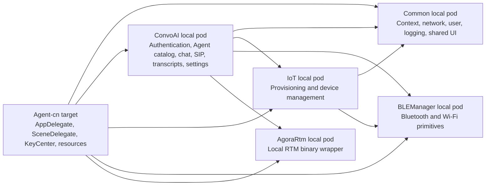
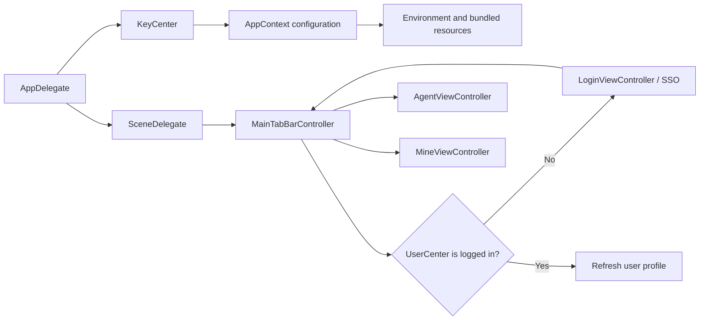
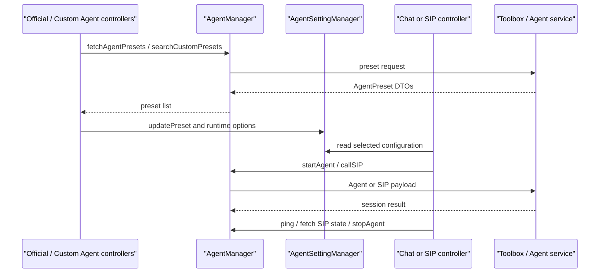
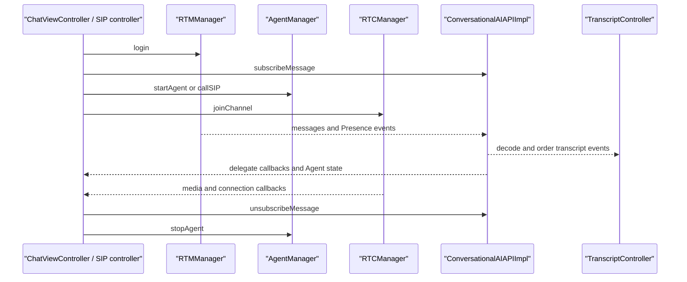
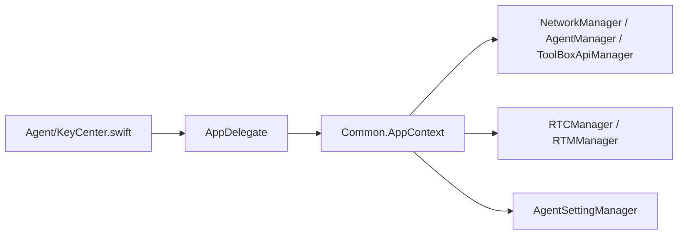

# iOS Architecture

This document gives developers and AI agents a durable model of the iOS repository: build topology, module ownership, runtime flows, configuration and contract boundaries, external integrations, and high-risk areas. Use the relevant README for setup or component integration and `AGENTS.md` for collaboration and acceptance rules.

## 1. System Context

Shengwang Convo AI Demo for iOS demonstrates:

- conversational AI sessions;
- Agora RTC and RTM media, messaging, and Presence;
- transcript rendering and Agent state;
- Agent presets plus LLM, TTS, and Avatar configuration;
- SIP calling;
- image and voiceprint workflows;
- IoT and BLE provisioning.

This is a demo application. Do not assume that demo defaults, local credentials, fixtures, or fallback behavior are production contracts.

## 2. Build and Module Topology

The application is built from `Agent.xcworkspace` with the `Agent-cn` scheme and CocoaPods. The app and test targets use iOS 15.0 and Swift 5.

| Component | Ownership | Notes |
|---|---|---|
| `Agent-cn` / `Agent` | App lifecycle, root window, configuration injection, app resources, permissions, signing, versioning | Entry files: `AppDelegate.swift` and `SceneDelegate.swift` |
| `Common` | `AppContext`, networking, user state, permissions, logging, resource lookup, shared UI | Broad consumer impact |
| `ConvoAI` | Login, Agent catalog, chat, SIP, settings, RTC/RTM coordination, ConversationalAI API, transcripts | Main product pod |
| `IoT` | Device list, setup, permission flow, scan, Wi-Fi provisioning, device API | Depends on Common and BLEManager |
| `BLEManager` | Bluetooth and Wi-Fi primitives | Device-dependent |
| `AgoraRtm` | Local RTM XCFramework wrapper | Used by ConvoAI runtime messaging |
| `Agent-cnTests` | Focused application and contract unit tests | Run through the workspace and `Agent-cn` scheme |

The app target depends on local pods through `Podfile`. `ConvoAI.podspec` also declares its module dependencies, so Podfile and podspec changes must remain consistent.

## 3. Runtime Flows

### 3.1 Startup and Authentication

- `AppDelegate` copies `KeyCenter` values into `AppContext` and prepares bundled resources.
- `SceneDelegate` installs `MainTabBarController` as the root controller.
- `MainTabBarController` checks `UserCenter`, refreshes user state, and presents login when required.
- `LoginManager` propagates login, logout, and profile changes to interested controllers.

### 3.2 Agent Catalog, Settings, and Control Plane

- `AgentPreset.swift` defines server-facing preset and language/avatar data.
- `AgentSettingManager` owns the selected preset and mutable session preferences.
- `AgentManager` owns Agent preset search, start, stop, ping, SIP call, and SIP status requests.
- `ToolBoxApiManager` owns adjacent Toolbox operations such as user data, uploads, metrics, and version-related requests.
- Payload keys, optional-field omission, defaults, preset classification, endpoint behavior, and response decoding form a backend contract. Update callers, mocks, and focused tests together.

### 3.3 Realtime Session and Transcript Path

- `ChatViewController` composes behavior through focused extensions for RTC, RTM, REST, UI, lifecycle, settings, and transcript modes.
- `RTCManager` and `RTMManager` own SDK lifecycle and delegate forwarding.
- `ConversationalAIAPIImpl` bridges RTM/Presence events and the public callback contract.
- `TranscriptController` combines RTM messages with RTC timing and emits ordered transcript and interruption updates.
- Outbound SIP uses a dedicated controller but shares the RTM, ConversationalAI API, settings, and server-contract boundaries.

### 3.4 IoT and BLE

```mermaid
flowchart LR
  catalog["Agent / Mine UI"] --> entrance["IoTEntrance"]
  entrance --> list["IOTListViewController"]
  list --> setup["DeviceIntroduction / DeviceAdding"]
  setup --> permission["Bluetooth and location checks"]
  permission --> scan["SearchDeviceViewController"]
  scan --> wifi["IOTWifiSettingViewController"]
  wifi --> manager["IOTDeviceManager / IOTApiManager"]
  manager --> ble["BLEManager"]
```

This path depends on Bluetooth, location, Wi-Fi, device firmware, backend state, and physical hardware. Simulator-only evidence is insufficient for end-to-end acceptance.

## 4. Configuration and Contract Boundaries

### 4.1 Configuration Injection

`AppContext` holds the server base URL, RTC identity, optional temporary RTC override, authentication values, LLM/TTS/Avatar configuration, environment data, and shared user-facing URLs. Never commit real App IDs, certificates, REST credentials, provider tokens, or production-only configuration.

### 4.2 Runtime Contracts

| Boundary | Primary owners | Change risk |
|---|---|---|
| Agent REST payloads and responses | `AgentManager.swift`, `AgentPreset.swift`, response models | Server compatibility, optional fields, defaults, error mapping, SIP behavior |
| Session preferences and selected preset | `AgentSettingManager.swift` | Cross-screen state, feature enablement, temporary RTC configuration |
| Shared environment and credentials | `KeyCenter.swift`, `AppContext.swift` | Endpoint selection, RTC identity, provider behavior, privacy |
| RTC and RTM lifecycle | `RTCManager.swift`, `RTMManager.swift` | Login/join order, reconnect, delegate lifetime, teardown |
| Conversational AI callbacks | `ConversationalAIAPI.swift`, `ConversationalAIAPIImpl.swift` | Public API, thread behavior, Presence and message compatibility |
| Transcript ordering and interruption | `TranscriptController.swift` and chat transcript adapters | Missing fields, out-of-order turns, timing, UI consistency |
| Local pod graph and resources | `Podfile` and local podspecs | Workspace resolution, consumer linkage, bundles, CI |

When an external contract is unavailable, use an explicitly authorized fixture and keep the missing server evidence visible. Do not infer production behavior from a local preset or mock response.

## 5. External Integrations and System Capabilities

Primary dependencies include:

- Agora RTC 4.5.1 and the local Agora RTM XCFramework;
- Toolbox and Agent services;
- LLM, TTS, and Avatar providers;
- SIP services;
- CocoaPods libraries for layout, images, logging, archives, progress UI, and crash reporting;
- IoT devices and BLE peripherals.

The app declares camera, microphone, photo-library, Bluetooth, and location usage plus background audio. Changes must cover authorization denial, retry, recovery, background/foreground transitions, and device limitations when relevant.

`pod install` downloads and extracts a demo resource archive unless `SKIP_DEMO_RESOURCE_DOWNLOAD=1` is set. Treat Pod installation, resource availability, and offline CI behavior as one build boundary.

## 6. High-Risk Areas

1. Agent preset and REST contracts: small key, default, or omission changes can alter standard, custom, SIP, open-source, and debug behavior.
2. `AppContext` and `KeyCenter`: shared server, credential, RTC, and provider configuration reaches most runtime paths.
3. RTC/RTM and `ConversationalAIAPIImpl`: asynchronous login, join, subscribe, reconnect, delegate, and teardown behavior meet here.
4. Transcript processing: message ordering, turn state, interruption, RTC timestamps, and UI updates are tightly coupled.
5. UIKit lifecycle: chat and SIP behavior spans multiple controller extensions, delegates, timers, tasks, and main-thread updates.
6. IoT and BLE: behavior depends on authorization, radios, Wi-Fi, hardware, firmware, and backend state.
7. CocoaPods and Xcode metadata: `Podfile`, podspecs, `project.pbxproj`, schemes, test targets, resources, signing, and build settings must remain aligned.

## 7. Validation Map

- App lifecycle or authentication: launch, root controller, logged-in and logged-out paths, session expiry, and localization.
- Agent preset or REST changes: focused payload/DTO tests, optional fields, defaults, error paths, SIP branches, callers, and the affected test target.
- Session runtime: RTM login/subscription, Agent start, RTC join, media callbacks, transcript updates, interruption, stop, and lifecycle recovery.
- UI: required loading, empty, error, success, interaction, navigation, and accessibility states on a runnable simulator or device with screenshots.
- `Common` or `AppContext`: affected pod consumers, configuration injection, temporary override/reset behavior, and privacy scanning.
- IoT/BLE: authorization denial/recovery, Bluetooth and location state, scan, provisioning, connection, and Wi-Fi behavior on suitable hardware.
- Pods/project/resources: `pod install` or an appropriate preflight, workspace/scheme resolution, affected architecture, focused build/test, and resource availability.

Use `Agent-cnTests` and the focused helpers under `scripts/` for logic whenever possible. A build-only result does not pass a logic acceptance criterion.

## 8. Reading Order and Documentation Boundaries

1. `AGENTS.md` for collaboration, permissions, profiles, and acceptance.
2. `ARCHITECTURE.md` for the repository model and risk boundaries.
3. `Scenes/ConvoAI/README.md` for product setup and navigation.
4. `Scenes/ConvoAI/ConvoAI/ConvoAI/Classes/ConversationalAIAPI/README.md` for component integration.
5. `.agents/skills/convoai-ios-workflow/references/ios_logic_ut.md` for focused test execution.

Keep task execution rules out of this document. Keep setup instructions, localized product documentation, and component-specific API details in their owning README files.
